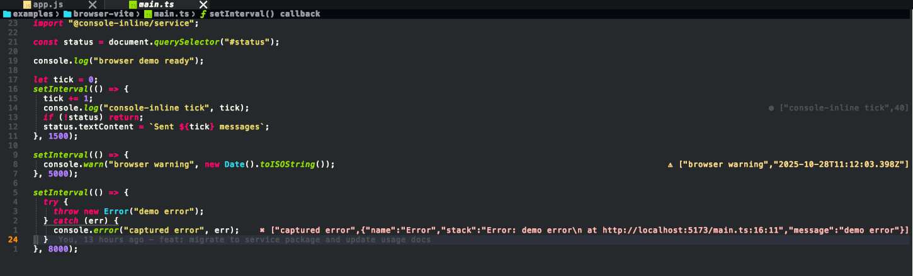
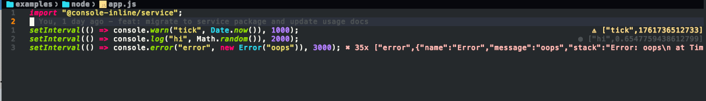
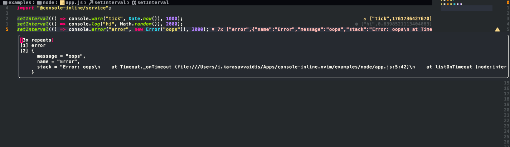
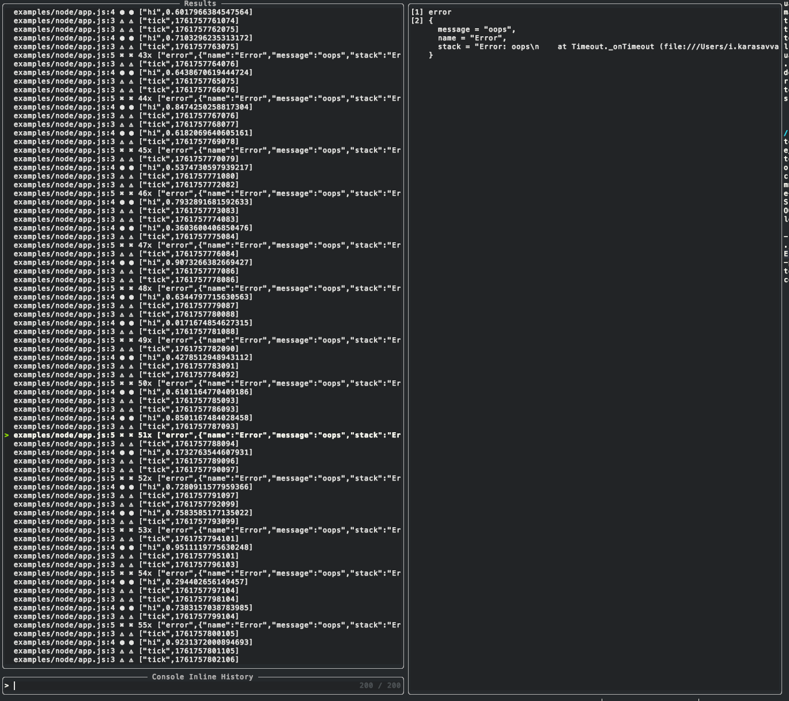

# console-inline.nvim

[](https://github.com/CoMfUcIoS/console-inline.nvim/actions/workflows/ci.yml)
[](https://github.com/CoMfUcIoS/console-inline.nvim/actions/workflows/lint.yml)
[](./LICENSE)

Zero-config Neovim plugin that shows `console.log / info / warn / error` **inline as virtual text at the emitting source line**.

> Inspired by the Console Ninja experience — re-designed for Neovim power users.

---

## Why this plugin exists

When debugging JavaScript or TypeScript, your attention constantly jumps between:

- Neovim (where the bug is)
- a terminal or browser DevTools (where the output is)

**console-inline.nvim removes that context switch.**

Runtime behavior is rendered _exactly where it originates_:

- logs
- errors
- stack traces
- timings
- network requests

All inline, all source-mapped, all inside Neovim.

---

## What it looks like (real output)

<p align="center">
  
  <br/>
  
  <br/>
  
  <br/>
  
</p>

---

## Core capabilities (user-facing)

### Inline runtime visibility

- `console.log`, `console.info`, `console.warn`, `console.error`
- `console.trace` with full call stacks
- `console.time` / `console.timeEnd` durations
- Runtime crashes and unhandled promise rejections

### Network awareness

- `fetch` and `XMLHttpRequest` events
- Status codes, errors, and request durations inline

### Inspection & navigation

- Automatic hover popups (`CursorHold`)
- Manual popup command for large payloads
- Telescope history picker across buffers
- Jump back to source from any recorded output

### Runtime support

- Node.js
- Browser (via WebSocket relay)
- Source-map-aware placement for TS / JSX / bundled code

---

## How it works (mental model)

1. A lightweight runtime service instruments console, errors, and network APIs
2. Events are forwarded to Neovim over a local TCP/WebSocket bridge
3. Neovim renders the output as virtual text beside the correct source line
4. Source maps are resolved when available for accurate placement

---

## Zero-config usage (recommended)

### Node.js

```js
import "@console-inline/service";

console.log("Hello from Node");
```

### Browser (Vite, React, Next.js, etc.)

```js
import "@console-inline/service";

console.log("Hello from the browser");
```

By default, the service only activates in development environments.

Override via:

```sh
CONSOLE_INLINE_ENABLED=true
CONSOLE_INLINE_DISABLED=true
```

---

## Installation (Lazy.nvim)

```lua
{
  "CoMfUcIoS/console-inline.nvim",
  version = "*",
  event = "VimEnter",
  opts = {
    host = "127.0.0.1",
    port = 36123,

    autostart = true,
    autostart_relay = true,
    open_missing_files = false,
    replay_persisted_logs = false,

    use_index = true,
    use_treesitter = true,
    incremental_index = true,
    index_batch_size = 900,
    treesitter_debounce_ms = 120,
    max_tokens_per_line = 120,
    skip_long_lines_len = 4000,

    prefer_original_source = true,
    resolve_source_maps = true,

    throttle_ms = 30,
    max_len = 160,

    severity_filter = {
      log = true,
      info = true,
      warn = true,
      error = true,
    },

    history_size = 200,

    hover = {
      enabled = true,
      events = { "CursorHold" },
      hide_events = { "CursorMoved", "CursorMovedI", "InsertEnter", "BufLeave" },
      border = "rounded",
      focusable = false,
      relative = "cursor",
      row = 1,
      col = 0,
    },
  },
}
```

---

## Commands

- `:ConsoleInlineToggle` — start/stop the server
- `:ConsoleInlineClear` — clear inline output
- `:ConsoleInlineCopy` — copy output at cursor
- `:ConsoleInlinePopup` — inspect full payload
- `:ConsoleInlineHistory` — Telescope history picker

---

## Changelog

See [CHANGELOG.md](./CHANGELOG.md) for release history.

---

## Support

If console-inline.nvim saves you time, consider sponsoring me on GitHub or buying me a coffee:

- GitHub Sponsors: https://github.com/sponsors/CoMfUcIoS
- Buy me a coffee: https://www.buymeacoffee.com/CoMfUcIoS

---

## License

GPL-3.0-or-later  
© 2025 Ioannis Karasavvaidis
