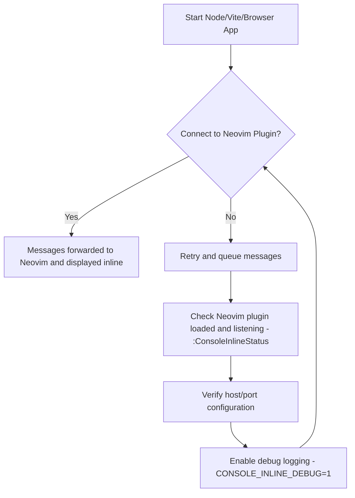

# @console-inline/service

Runtime helper for [console-inline.nvim](https://github.com/comfucios/console-inline.nvim).
Importing this package patches the global `console` object so every `log/info/warn/error`
call is forwarded to your Neovim instance and displayed inline as virtual text.

> Inspired by the workflow popularised by Wallaby.js [Console Ninja](https://marketplace.visualstudio.com/items?itemName=WallabyJs.console-ninja) — think of this as the Neovim-native counterpart.

> **Required:** make sure the Neovim plugin is installed and its TCP server is running
> (`autostart = true` by default). Without the plugin listening on the configured host and
> port this package will keep retrying and queueing messages.

## Installation

```bash
npm install @console-inline/service
```

Use any bundler/runtime that understands ESM (Node 16+, Vite, Next.js, etc.).

## Quick start

### Node.js / CLI

```js
import "@console-inline/service";

console.log("Hello from Node!");
console.warn({ status: "demo" });
console.info("info");
```

### Browser / React

For browsers, the Neovim plugin auto-starts the bundled relay (`:ConsoleInlineRelayBuild` / `npm run build:relay`).

```ts
// e.g. in src/main.tsx
import "@console-inline/service";

console.info("Rendered from the browser");
console.warn({ status: "demo" });
console.log("log");
```

In Node runtimes the package connects directly to the Neovim TCP endpoint; browser runtimes rely on the auto-started relay managed by the Neovim plugin. No extra scripts required.

By default the service only patches consoles in development (`NODE_ENV !== "production"`, `import.meta.env.DEV`, etc.). Set `CONSOLE_INLINE_ENABLED=true` to keep it on, or `CONSOLE_INLINE_DISABLED=true` to opt out.

## Configuration

Environment variables let you point the relay at a different host/port or tweak behaviour:

| Variable                         | Default     | Description                                       |
| -------------------------------- | ----------- | ------------------------------------------------- |
| `CONSOLE_INLINE_HOST`            | `127.0.0.1` | Hostname of the Neovim TCP server                 |
| `CONSOLE_INLINE_PORT`            | `36123`     | TCP port exposed by `console-inline.nvim`         |
| `CONSOLE_INLINE_WS_RECONNECT_MS` | `1000`      | Delay between WebSocket reconnect attempts        |
| `CONSOLE_INLINE_MAX_QUEUE`       | `200`       | Maximum buffered messages while Neovim is offline |
| `CONSOLE_INLINE_DEBUG`           | off         | Enables verbose logging for troubleshooting       |

Set these in your shell (`export`) or via `process.env` / `import.meta.env` before the first
import executes.

## Troubleshooting

- Ensure Neovim has the plugin loaded and listening (`:ConsoleInlineStatus`).
- If you change the plugin’s host/port, mirror the same values as environment variables
  before starting your Node/Vite app.
- Use `CONSOLE_INLINE_DEBUG=1` to print connection attempts, retries, and queue drops.


